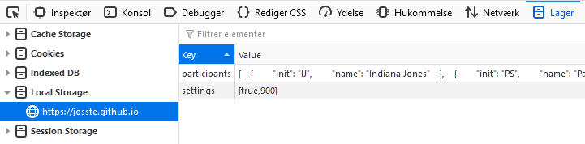
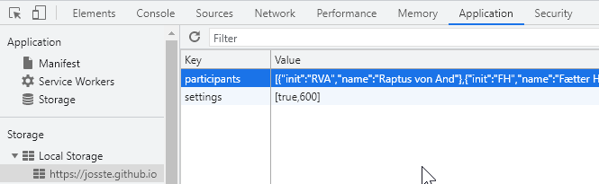

# ScrumTimer

This is a *decentral* Daily Scrum Timer based on localstorage, with a database of team members.

Accessible online: https://josste.github.io/ScrumTimer/

[](https://github.com/JoSSte/ScrumTimer/actions/workflows/main.yml)

## How to use it

## Notes
* This is built using Angular and a lot of libraries that I try to make sure do not have any vulnerabilities, by keeping them updated. The only included remote access library is [httpclient](https://angular.io/guide/http) but as in all software, you cannot be 100% sure that none of your includes haven't been compromised.
* Originally I used this to learn some Angular, so it is probably bloated compared to the function it provides.


## Usage

There are three ways to use the Scrum Timer.

1. Standalone
   * Open the scrumtimer in one window.
   * Open your story management tool (e.g. Jira) in another window.
   * Arrange them as you like.
3. Popup
   * Make sure that you have the URL of your Story management system (e.g. Jira) in the settings.
   * Open the Scrumtimer click **popout** to open a narrow scrumtimer window, and your favorite Story management URL in another.
   * Arrange windows as you prefer.  
5. Popin
   * Use one of the scripts below here to integrate the ScrumTimer with the Story management web application.  
   * Note that this is essentially a XSS trick. You should NEVER enter Javascript that you don't understand into the Developer Console/add it to a bookmarklet.  

## Bookmarklets / Popin Scripts
These scripts are used to inject scrumtimer into e.g. Jira instead of creating an inline popup (I call them pop-ins)  
These can either be put in a tool for creating a bookmarklet like the ones listed below. I do not provide direct links, to bookmarklets, since I WANT the user to be concious of what they are doing.
* https://www.yourjs.com/bookmarklet/  
* https://mrcoles.com/bookmarklet/  


... or pasted into the devtools console ( press **F12** and choose *console* ).  
*Please don't tell non-tech savvy people to do this. If they get into the habit of pasting random js into the development console all hell may break out. If I get the time and an indication of many people using this, i may create browser plugins instead.*

They will create a div element in the right hand side of the screen with the scrumtimer included.  
*REFRESHING THE PAGE REMOVES THE TIMER* - if you want the timer to stay, please use the *popout* link.  

### Bookmarklet - Generic version

``` js
//TODO: Resize window contents instead of sitting on top of the page
let d = document.createElement("div");
d.id = "ScrumTimerDiv";
d.innerHTML = "<a href=\"javascript:console.log(document.getElementById('ScrumTimerDiv').remove())\">X close ScrumTimer</a><iframe src=\"https://josste.github.io/ScrumTimer/#/popin\" style=\"width:100%; height:100%\"> Hello World </iframe>";
d.style='position: absolute; top: 0; right:0; width:350px; bottom: 0; z-index: 100; background-color: rgba(100,100,100,0.9) ';
document.getElementsByTagName('body')[0].append(d);
```

### Bookmarklet - Jira version
This script will add the scrumtimer in the Jira details pane which shows details of a story, as long as you are in the "Active Sprints" view.
``` js
let r = document.getElementById('ghx-work');
if(r !== null){
  let d = document.createElement("div");
  d.id = "ScrumTimerDiv";
  d.innerHTML = "<a href=\"javascript:console.log(document.getElementById('ScrumTimerDiv').remove())\">X close ScrumTimer</a><iframe src=\"https://josste.github.io/ScrumTimer/#/popin\" style=\" width:100%; height:100%\"> Hello World </iframe>";
  d.class="ghx-detail-view gh-editable-detail-view ui-resizable";
  r.append(d);
} else {
  console.log('[Scrumtimer] No Div found with the id "ghx-work"... Are you in Jira?');
  alert('Scrumtimer could not find the right html element.... Are you in Jira?');
}

```

## Sample Data
These can also be found at [sample.participants.json](/resources/sample.participants.json) if you want to test the centralized JSON option.  
To test locally use http://localhost:4200/assets/json/participants_andeby.json  

``` json
[
    {
        "init": "IJ",
        "name": "Indiana Jones"
    },
    {
        "init": "PS",
        "name": "Papa Smurf"
    },
    {
        "init": "TT",
        "name": "Tintin"
    },
    {
        "init": "MM",
        "name": "Mickey Mouse"
    },
    {
        "init": "SMcD",
        "name": "Scrooge McDuck"
    },
    {
        "init": "DD",
        "name": "Donald Duck"
    }
]

```

## Privacy & Philosophy
I developed this while working in a company with a very strict data protection policy, and a lengthy process for onboarding tools.  
It is designed to **NOT** use cookies, **NOT** use any webservices and store everything in localstorage, so even if you delete cookies regularly it will persist. Unfortunately this means that you need to exchange a json string if you want to share the list with a colleague.
The tool was developed as a response to Daily scrum meetings frequently running over time, so the main focus is to keep awareness on the time, and let everyone speak, and making the order pseudo-random so it's not always *"Adam Adamson"* who has to go first every day.

### What is sent to the server?
Nothing. Pure and simple.  
If you have seleted the remote participant list you are in effect fetching a file from another server, so there may be some tracking there...

### What is stored on my computer?
In Localstorage (Press <kbd>F12</kbd> -  select application/storage - localstorage) there will be an entry called *settings* storing all the settings in a JSON array and an entry called *participants* also in a JSON array.

#### Localstorage in Firefox

#### Localstorage in Chrome



